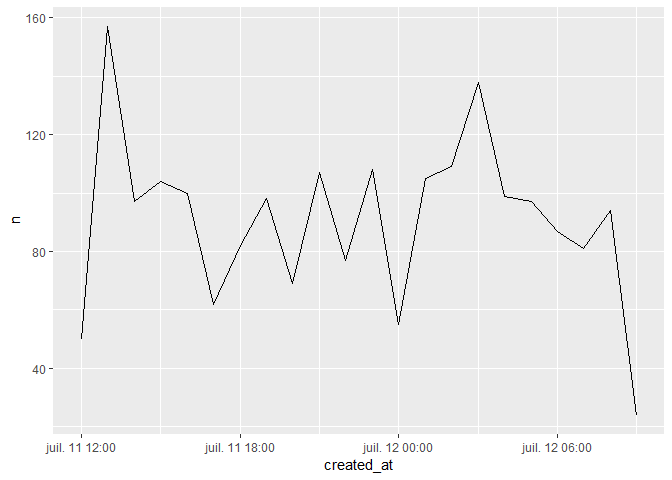

edouaRd
================

This is a package of practical things I use every day. Thus, it is not really community oriented.

`edouaRd` can be installed from Github :

``` r
# install.packages("devtools")
devtools::install_github("edouardschuppert/edouaRd")
```

povertext
=========

`povertext` deplete your text, it deletes any accents or umlaut.

``` r
library(edouaRd, quietly = TRUE)

povertext(c("Père Noël", "Où êtes-vous ?"))
```

    ## [1] "pere noel"      "ou etes-vous ?"

wordfrequency, bigramfrequency & hashtagfrequency
=================================================

`wordfrequency` splits character strings into words and classifies them, so you know which ones are the most used. `bigramfrequency` does the same thing, but with bigrams. `hashtagfrequency` does the same thing, but with the hashtags. The possibility is offered to keep only part of this data.

``` r
library(tidyverse, quietly = TRUE)
```

    ## ── Attaching packages ────────────────────────────────── tidyverse 1.2.1 ──

    ## ✔ ggplot2 2.2.1.9000     ✔ purrr   0.2.5     
    ## ✔ tibble  1.4.2          ✔ dplyr   0.7.5     
    ## ✔ tidyr   0.8.1          ✔ stringr 1.3.1     
    ## ✔ readr   1.1.1          ✔ forcats 0.3.0

    ## ── Conflicts ───────────────────────────────────── tidyverse_conflicts() ──
    ## ✖ dplyr::filter() masks stats::filter()
    ## ✖ dplyr::lag()    masks stats::lag()

``` r
edouaRd::rstats %>% 
  wordfrequency(text)
```

    ## # A tibble: 10,090 x 2
    ##    words               n
    ##    <chr>           <int>
    ##  1 rstats          13757
    ##  2 datascience      4407
    ##  3 data             2862
    ##  4 bigdata          2796
    ##  5 python           2746
    ##  6 machinelearning  2488
    ##  7 analytics        1899
    ##  8 ai               1568
    ##  9 gp_pulipaka      1280
    ## 10 dataviz          1215
    ## # ... with 10,080 more rows

``` r
edouaRd::rstats %>% 
  hashtagfrequency(text, slice = 50)
```

    ## # A tibble: 50 x 2
    ##    hashtags             n
    ##    <chr>            <int>
    ##  1 #rstats          13715
    ##  2 #datascience      4405
    ##  3 #bigdata          2774
    ##  4 #machinelearning  2475
    ##  5 #python           2294
    ##  6 #analytics        1754
    ##  7 #ai               1530
    ##  8 #dataviz          1194
    ##  9 #golang           1124
    ## 10 #javascript       1092
    ## # ... with 40 more rows

``` r
edouaRd::rstats %>% 
  bigramfrequency(text, slice = 50)
```

    ## # A tibble: 50 x 2
    ##    bigram                          n
    ##    <chr>                       <int>
    ##  1 python rstats                1290
    ##  2 datascience ai               1117
    ##  3 machinelearning datascience  1089
    ##  4 bigdata machinelearning      1045
    ##  5 rstats datascience           1035
    ##  6 bigdata datascience           782
    ##  7 cloudcomputing serverless     697
    ##  8 abdsc bigdata                 537
    ##  9 java javascript               506
    ## 10 cloud cloudcomputing          475
    ## # ... with 40 more rows

datetimes\_fr & dates\_fr
=========================

`datetimes_fr` turn your datetimes into a french format. `dates_fr` does the same thing, with only the dates. Please note that this is NOT a useful format to work with R. This function can only be used with a purpose of report, in order to have a very understandable format.

``` r
Sys.time()
```

    ## [1] "2018-06-22 16:31:29 CEST"

``` r
datetimes_fr(Sys.time())
```

    ## [1] "22/06/2018 14:31:29"

``` r
dates_fr(Sys.time())
```

    ## [1] "22/06/2018"

restore\_dates
==============

`restore_dates` has the opposite effect to `datetimes_fr`; it restores the dates having a French format in a format usable by R.

``` r
restore_dates("12/01/1993 21:45:36")
```

    ## [1] "1993-01-12 21:45:36 UTC"

distribution\_time
==================

`distribution_time` is used to check the temporal distribution of a dataset.

``` r
edouaRd::rstats %>% 
  distribution_time(created_at)
```

    ## # A tibble: 11 x 2
    ##    created_at     n
    ##    <date>     <int>
    ##  1 2018-05-19   265
    ##  2 2018-05-20   817
    ##  3 2018-05-21   979
    ##  4 2018-05-22  1550
    ##  5 2018-05-23  1697
    ##  6 2018-05-24  1738
    ##  7 2018-05-25  1886
    ##  8 2018-05-26  1128
    ##  9 2018-05-27  1274
    ## 10 2018-05-28  1532
    ## 11 2018-05-29   807

With the `draw` argument, this distribution can be expressed more visually.

``` r
edouaRd::rstats %>% 
  distribution_time(created_at, draw = TRUE)
```



choose\_period
==============

`choose_period` allows to filter a corpus by an entry date and an exit date.

``` r
edouaRd::rstats %>% 
  choose_period(created_at, "2018-05-22", "2018-05-27")
```

    ## # A tibble: 9,273 x 36
    ##    id     time  created_at          from_user_name text       filter_level
    ##    <chr>  <chr> <dttm>              <chr>          <chr>      <chr>       
    ##  1 99871… 1526… 2018-05-22 00:00:13 Rbloggers      Competiti… none        
    ##  2 99871… 1526… 2018-05-22 00:00:27 ttibensky      RT @KirkD… none        
    ##  3 99871… 1526… 2018-05-22 00:00:34 renato_umeton  RT @Rblog… none        
    ##  4 99871… 1526… 2018-05-22 00:00:40 kierisi        I can't g… none        
    ##  5 99871… 1526… 2018-05-22 00:01:08 keita321231    RT @hadle… none        
    ##  6 99871… 1526… 2018-05-22 00:01:39 mdancho84      RT @hadle… none        
    ##  7 99871… 1526… 2018-05-22 00:02:58 LeeLeo1993     "RT @data… none        
    ##  8 99871… 1526… 2018-05-22 00:04:33 pamhanway      RT @paulv… none        
    ##  9 99871… 1526… 2018-05-22 00:06:40 Addifaerber    Problem: … none        
    ## 10 99871… 1526… 2018-05-22 00:07:02 jmkreinz       RT @hadle… none        
    ## # ... with 9,263 more rows, and 30 more variables:
    ## #   possibly_sensitive <int>, withheld_copyright <chr>,
    ## #   withheld_scope <chr>, truncated <chr>, retweet_count <int>,
    ## #   favorite_count <int>, lang <chr>, to_user_name <chr>,
    ## #   in_reply_to_status_id <chr>, quoted_status_id <chr>, source <chr>,
    ## #   location <chr>, lat <chr>, lng <chr>, from_user_id <chr>,
    ## #   from_user_realname <chr>, from_user_verified <int>,
    ## #   from_user_description <chr>, from_user_url <chr>,
    ## #   from_user_profile_image_url <chr>, from_user_utcoffset <chr>,
    ## #   from_user_timezone <chr>, from_user_lang <chr>,
    ## #   from_user_tweetcount <int>, from_user_followercount <int>,
    ## #   from_user_friendcount <int>, from_user_favourites_count <int>,
    ## #   from_user_listed <int>, from_user_withheld_scope <chr>,
    ## #   from_user_created_at <dttm>

It is possible, as arguments, to also add a filter by hours, and to sort from oldest to newest.

``` r
edouaRd::rstats %>% 
  choose_period(created_at, "2018-05-22", "2018-05-27", starttime = "16:00:00", endtime = "12:00:00", sort = TRUE)
```

    ## # A tibble: 7,707 x 36
    ##    id     time  created_at          from_user_name text       filter_level
    ##    <chr>  <chr> <dttm>              <chr>          <chr>      <chr>       
    ##  1 99895… 1527… 2018-05-22 16:00:01 RLangTip       List of R… none        
    ##  2 99895… 1527… 2018-05-22 16:00:29 Photogratte    RT @RLang… none        
    ##  3 99895… 1527… 2018-05-22 16:00:33 ALuisaPinho    RT @danil… none        
    ##  4 99895… 1527… 2018-05-22 16:00:48 JimChurch2     RT @RLang… none        
    ##  5 99895… 1527… 2018-05-22 16:01:30 idtince        RT @theot… none        
    ##  6 99895… 1527… 2018-05-22 16:01:51 FunkyCity2     RT @RLang… none        
    ##  7 99895… 1527… 2018-05-22 16:02:09 CRANberriesFe… CRAN upda… none        
    ##  8 99895… 1527… 2018-05-22 16:02:15 infj_ingrid    RT @Janin… none        
    ##  9 99895… 1527… 2018-05-22 16:02:21 5berto         RT @RLang… none        
    ## 10 99895… 1527… 2018-05-22 16:02:34 CL_Booth       RT @RLang… none        
    ## # ... with 7,697 more rows, and 30 more variables:
    ## #   possibly_sensitive <int>, withheld_copyright <chr>,
    ## #   withheld_scope <chr>, truncated <chr>, retweet_count <int>,
    ## #   favorite_count <int>, lang <chr>, to_user_name <chr>,
    ## #   in_reply_to_status_id <chr>, quoted_status_id <chr>, source <chr>,
    ## #   location <chr>, lat <chr>, lng <chr>, from_user_id <chr>,
    ## #   from_user_realname <chr>, from_user_verified <int>,
    ## #   from_user_description <chr>, from_user_url <chr>,
    ## #   from_user_profile_image_url <chr>, from_user_utcoffset <chr>,
    ## #   from_user_timezone <chr>, from_user_lang <chr>,
    ## #   from_user_tweetcount <int>, from_user_followercount <int>,
    ## #   from_user_friendcount <int>, from_user_favourites_count <int>,
    ## #   from_user_listed <int>, from_user_withheld_scope <chr>,
    ## #   from_user_created_at <dttm>

rm\_empty\_cols
===============

`rm_empty_cols` allows to delete the columns of an array containing only NAs.

``` r
edouaRd::rstats
```

    ## # A tibble: 13,673 x 36
    ##    id     time  created_at          from_user_name text       filter_level
    ##    <chr>  <chr> <dttm>              <chr>          <chr>      <chr>       
    ##  1 99784… 1526… 2018-05-19 14:21:04 NicholasStray… Redid my … none        
    ##  2 99784… 1526… 2018-05-19 14:28:34 CMastication   "Are you … none        
    ##  3 99784… 1526… 2018-05-19 14:30:40 jrosenberg6432 excited t… none        
    ##  4 99784… 1526… 2018-05-19 14:30:47 lisafederer    Getting r… none        
    ##  5 99784… 1526… 2018-05-19 14:36:11 RLadiesSantaFe ¡Las insc… none        
    ##  6 99785… 1526… 2018-05-19 14:45:11 hrbrmstr       "cloc (ht… none        
    ##  7 99785… 1526… 2018-05-19 14:45:49 hrbrmstr       "RT @CMas… none        
    ##  8 99785… 1526… 2018-05-19 14:48:10 theredpea      RT @Nicho… none        
    ##  9 99785… 1526… 2018-05-19 14:49:05 _StarKingdom   New artic… none        
    ## 10 99785… 1526… 2018-05-19 14:50:36 tejendrapsingh RT @krlml… none        
    ## # ... with 13,663 more rows, and 30 more variables:
    ## #   possibly_sensitive <int>, withheld_copyright <chr>,
    ## #   withheld_scope <chr>, truncated <chr>, retweet_count <int>,
    ## #   favorite_count <int>, lang <chr>, to_user_name <chr>,
    ## #   in_reply_to_status_id <chr>, quoted_status_id <chr>, source <chr>,
    ## #   location <chr>, lat <chr>, lng <chr>, from_user_id <chr>,
    ## #   from_user_realname <chr>, from_user_verified <int>,
    ## #   from_user_description <chr>, from_user_url <chr>,
    ## #   from_user_profile_image_url <chr>, from_user_utcoffset <chr>,
    ## #   from_user_timezone <chr>, from_user_lang <chr>,
    ## #   from_user_tweetcount <int>, from_user_followercount <int>,
    ## #   from_user_friendcount <int>, from_user_favourites_count <int>,
    ## #   from_user_listed <int>, from_user_withheld_scope <chr>,
    ## #   from_user_created_at <dttm>

``` r
rm_empty_cols(edouaRd::rstats)
```

    ## # A tibble: 13,673 x 28
    ##    id     time  created_at          from_user_name text       filter_level
    ##    <chr>  <chr> <dttm>              <chr>          <chr>      <chr>       
    ##  1 99784… 1526… 2018-05-19 14:21:04 NicholasStray… Redid my … none        
    ##  2 99784… 1526… 2018-05-19 14:28:34 CMastication   "Are you … none        
    ##  3 99784… 1526… 2018-05-19 14:30:40 jrosenberg6432 excited t… none        
    ##  4 99784… 1526… 2018-05-19 14:30:47 lisafederer    Getting r… none        
    ##  5 99784… 1526… 2018-05-19 14:36:11 RLadiesSantaFe ¡Las insc… none        
    ##  6 99785… 1526… 2018-05-19 14:45:11 hrbrmstr       "cloc (ht… none        
    ##  7 99785… 1526… 2018-05-19 14:45:49 hrbrmstr       "RT @CMas… none        
    ##  8 99785… 1526… 2018-05-19 14:48:10 theredpea      RT @Nicho… none        
    ##  9 99785… 1526… 2018-05-19 14:49:05 _StarKingdom   New artic… none        
    ## 10 99785… 1526… 2018-05-19 14:50:36 tejendrapsingh RT @krlml… none        
    ## # ... with 13,663 more rows, and 22 more variables:
    ## #   possibly_sensitive <int>, retweet_count <int>, favorite_count <int>,
    ## #   lang <chr>, to_user_name <chr>, in_reply_to_status_id <chr>,
    ## #   quoted_status_id <chr>, source <chr>, location <chr>,
    ## #   from_user_id <chr>, from_user_realname <chr>,
    ## #   from_user_verified <int>, from_user_description <chr>,
    ## #   from_user_url <chr>, from_user_profile_image_url <chr>,
    ## #   from_user_lang <chr>, from_user_tweetcount <int>,
    ## #   from_user_followercount <int>, from_user_friendcount <int>,
    ## #   from_user_favourites_count <int>, from_user_listed <int>,
    ## #   from_user_created_at <dttm>

Please report issues and suggestions to the [issues tracker](https://github.com/edouardschuppert/edouaRd/issues).
