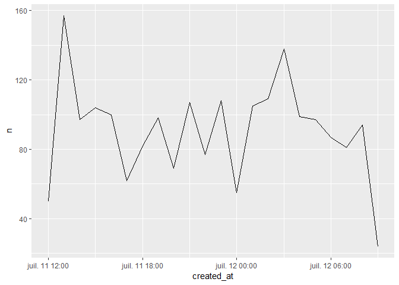

edouaRd
================

Ceci est un package de trucs pratiques que j'utilise au quotidien. C'est pourquoi il n'est pas très orienté communauté.

`edouaRd` peut être installé depuis GitHub :

``` r
# install.packages("devtools")
devtools::install_github("edouardschuppert/edouaRd")
```

povertext
=========

`povertext` permet d'appauvrir le texte, en supprimant tous les accents et trémas.

``` r
library(edouaRd, quietly = TRUE)

povertext(c("Père Noël", "Où êtes-vous ?"))
```

    ## [1] "pere noel"      "ou etes-vous ?"

wordfrequency, bigramfrequency & hashtagfrequency
=================================================

`wordfrequency` découpe les phrases en mots et les classe, permettant ainsi de savoir lesquels sont les plus utilisés. `bigramfrequency` fait la même chose, mais avec des bigrams. `hashtagfrequency` fait la même chose, mais avec les hashtags. La possibilité est offerte de ne garder qu'une partie de ces données.

``` r
library(tidyverse, quietly = TRUE)
```

    ## -- Attaching packages ---------------------- tidyverse 1.2.1 --

    ## v ggplot2 3.0.0     v purrr   0.2.5
    ## v tibble  1.4.2     v dplyr   0.7.6
    ## v tidyr   0.8.1     v stringr 1.3.1
    ## v readr   1.1.1     v forcats 0.3.0

    ## -- Conflicts ------------------------- tidyverse_conflicts() --
    ## x dplyr::filter() masks stats::filter()
    ## x dplyr::lag()    masks stats::lag()

``` r
edouaRd::rstats %>% 
  wordfrequency(text)
```

    ## # A tibble: 3,279 x 2
    ##    words           n
    ##    <chr>       <int>
    ##  1 rstats       2038
    ##  2 datascience   600
    ##  3 python        514
    ##  4 bigdata       448
    ##  5 analytics     421
    ##  6 javascript    401
    ##  7 reactjs       389
    ##  8 vuejs         389
    ##  9 golang        385
    ## 10 serverless    382
    ## # ... with 3,269 more rows

``` r
edouaRd::rstats %>% 
  hashtagfrequency(text, slice = 30, original = TRUE)
```

    ## # A tibble: 30 x 2
    ##    hashtags         n
    ##    <chr>        <int>
    ##  1 #rstats       2038
    ##  2 #DataScience   600
    ##  3 #Python        462
    ##  4 #BigData       448
    ##  5 #Analytics     413
    ##  6 #JavaScript    391
    ##  7 #ReactJS       389
    ##  8 #VueJS         389
    ##  9 #GoLang        385
    ## 10 #Serverless    382
    ## # ... with 20 more rows

``` r
edouaRd::rstats %>% 
  bigramfrequency(text, slice = 50)
```

    ## # A tibble: 50 x 2
    ##    bigram                        n
    ##    <chr>                     <int>
    ##  1 python rstats               410
    ##  2 reactjs vuejs               389
    ##  3 javascript reactjs          381
    ##  4 vuejs golang                378
    ##  5 bigdata analytics           374
    ##  6 java javascript             341
    ##  7 rstats tensorflow           339
    ##  8 datascience ai              307
    ##  9 cloudcomputing serverless   300
    ## 10 tensorflow java             281
    ## # ... with 40 more rows

datetimes\_fr & dates\_fr
=========================

`datetimes_fr` transforme les dates et heures en un format français. `dates_fr` fait la même chose mais uniquement avec les dates. Il faut noter que ceci n'est PAS un format utile pour travailler avec R. Cette fonction ne peut être utilisée que dans un but de rapport ou de présentation, afin d'obtenir un format très compréhensible.

``` r
Sys.time()
```

    ## [1] "2018-10-14 02:18:20 CEST"

``` r
datetimes_fr(Sys.time())
```

    ## [1] "14/10/2018 00:18:20"

``` r
dates_fr(Sys.time())
```

    ## [1] "14/10/2018"

restore\_dates
==============

`restore_dates` provoque l'effet inverse à celui de `datetimes_fr` ; il restaure les dates ayant un format français en un format utilisable par R.

``` r
restore_dates("12/01/1993 21:45:36")
```

    ## [1] "1993-01-12 21:45:36 UTC"

distribution\_time
==================

`distribution_time` permet de vérifier la distribution temporelle d'un jeu de données.

``` r
edouaRd::rstats %>% 
  distribution_time(created_at, granularity = "hour")
```

    ## # A tibble: 22 x 2
    ##    created_at              n
    ##    <dttm>              <int>
    ##  1 2018-07-11 12:00:00    50
    ##  2 2018-07-11 13:00:00   157
    ##  3 2018-07-11 14:00:00    97
    ##  4 2018-07-11 15:00:00   104
    ##  5 2018-07-11 16:00:00   100
    ##  6 2018-07-11 17:00:00    62
    ##  7 2018-07-11 18:00:00    82
    ##  8 2018-07-11 19:00:00    98
    ##  9 2018-07-11 20:00:00    69
    ## 10 2018-07-11 21:00:00   107
    ## # ... with 12 more rows

Avec l'argument draw, cette distribution peut être exprimée de manière plus visuelle.

``` r
edouaRd::rstats %>% 
  distribution_time(created_at, granularity = "hour", draw = TRUE)
```



choose\_period
==============

`choose_period` permet de filtrer un corpus par une date d'entrée et une date de sortie.

``` r
edouaRd::rstats %>% 
  choose_period(created_at, "2018-05-22", "2018-05-27")
```

    ## # A tibble: 0 x 88
    ## # ... with 88 variables: user_id <chr>, status_id <chr>,
    ## #   created_at <dttm>, screen_name <chr>, text <chr>, source <chr>,
    ## #   display_text_width <dbl>, reply_to_status_id <chr>,
    ## #   reply_to_user_id <chr>, reply_to_screen_name <chr>, is_quote <lgl>,
    ## #   is_retweet <lgl>, favorite_count <int>, retweet_count <int>,
    ## #   hashtags <list>, symbols <list>, urls_url <list>, urls_t.co <list>,
    ## #   urls_expanded_url <list>, media_url <list>, media_t.co <list>,
    ## #   media_expanded_url <list>, media_type <list>, ext_media_url <list>,
    ## #   ext_media_t.co <list>, ext_media_expanded_url <list>,
    ## #   ext_media_type <chr>, mentions_user_id <list>,
    ## #   mentions_screen_name <list>, lang <chr>, quoted_status_id <chr>,
    ## #   quoted_text <chr>, quoted_created_at <dttm>, quoted_source <chr>,
    ## #   quoted_favorite_count <int>, quoted_retweet_count <int>,
    ## #   quoted_user_id <chr>, quoted_screen_name <chr>, quoted_name <chr>,
    ## #   quoted_followers_count <int>, quoted_friends_count <int>,
    ## #   quoted_statuses_count <int>, quoted_location <chr>,
    ## #   quoted_description <chr>, quoted_verified <lgl>,
    ## #   retweet_status_id <chr>, retweet_text <chr>,
    ## #   retweet_created_at <dttm>, retweet_source <chr>,
    ## #   retweet_favorite_count <int>, retweet_retweet_count <int>,
    ## #   retweet_user_id <chr>, retweet_screen_name <chr>, retweet_name <chr>,
    ## #   retweet_followers_count <int>, retweet_friends_count <int>,
    ## #   retweet_statuses_count <int>, retweet_location <chr>,
    ## #   retweet_description <chr>, retweet_verified <lgl>, place_url <chr>,
    ## #   place_name <chr>, place_full_name <chr>, place_type <chr>,
    ## #   country <chr>, country_code <chr>, geo_coords <list>,
    ## #   coords_coords <list>, bbox_coords <list>, status_url <chr>,
    ## #   name <chr>, location <chr>, description <chr>, url <chr>,
    ## #   protected <lgl>, followers_count <int>, friends_count <int>,
    ## #   listed_count <int>, statuses_count <int>, favourites_count <int>,
    ## #   account_created_at <dttm>, verified <lgl>, profile_url <chr>,
    ## #   profile_expanded_url <chr>, account_lang <chr>,
    ## #   profile_banner_url <chr>, profile_background_url <chr>,
    ## #   profile_image_url <chr>

Il est possible, comme arguments, d'ajouter également un filtre par heures, et d'opérer un tri du plus ancien au plus récent.

``` r
edouaRd::rstats %>% 
  choose_period(created_at, "2018-05-22", "2018-05-27", starttime = "16:00:00", endtime = "12:00:00", sort = TRUE)
```

    ## # A tibble: 0 x 88
    ## # ... with 88 variables: user_id <chr>, status_id <chr>,
    ## #   created_at <dttm>, screen_name <chr>, text <chr>, source <chr>,
    ## #   display_text_width <dbl>, reply_to_status_id <chr>,
    ## #   reply_to_user_id <chr>, reply_to_screen_name <chr>, is_quote <lgl>,
    ## #   is_retweet <lgl>, favorite_count <int>, retweet_count <int>,
    ## #   hashtags <list>, symbols <list>, urls_url <list>, urls_t.co <list>,
    ## #   urls_expanded_url <list>, media_url <list>, media_t.co <list>,
    ## #   media_expanded_url <list>, media_type <list>, ext_media_url <list>,
    ## #   ext_media_t.co <list>, ext_media_expanded_url <list>,
    ## #   ext_media_type <chr>, mentions_user_id <list>,
    ## #   mentions_screen_name <list>, lang <chr>, quoted_status_id <chr>,
    ## #   quoted_text <chr>, quoted_created_at <dttm>, quoted_source <chr>,
    ## #   quoted_favorite_count <int>, quoted_retweet_count <int>,
    ## #   quoted_user_id <chr>, quoted_screen_name <chr>, quoted_name <chr>,
    ## #   quoted_followers_count <int>, quoted_friends_count <int>,
    ## #   quoted_statuses_count <int>, quoted_location <chr>,
    ## #   quoted_description <chr>, quoted_verified <lgl>,
    ## #   retweet_status_id <chr>, retweet_text <chr>,
    ## #   retweet_created_at <dttm>, retweet_source <chr>,
    ## #   retweet_favorite_count <int>, retweet_retweet_count <int>,
    ## #   retweet_user_id <chr>, retweet_screen_name <chr>, retweet_name <chr>,
    ## #   retweet_followers_count <int>, retweet_friends_count <int>,
    ## #   retweet_statuses_count <int>, retweet_location <chr>,
    ## #   retweet_description <chr>, retweet_verified <lgl>, place_url <chr>,
    ## #   place_name <chr>, place_full_name <chr>, place_type <chr>,
    ## #   country <chr>, country_code <chr>, geo_coords <list>,
    ## #   coords_coords <list>, bbox_coords <list>, status_url <chr>,
    ## #   name <chr>, location <chr>, description <chr>, url <chr>,
    ## #   protected <lgl>, followers_count <int>, friends_count <int>,
    ## #   listed_count <int>, statuses_count <int>, favourites_count <int>,
    ## #   account_created_at <dttm>, verified <lgl>, profile_url <chr>,
    ## #   profile_expanded_url <chr>, account_lang <chr>,
    ## #   profile_banner_url <chr>, profile_background_url <chr>,
    ## #   profile_image_url <chr>

rm\_empty\_cols
===============

`rm_empty_cols` permet de supprimer les colonnes d'un tableau ne comprenant que des NA.

``` r
edouaRd::rstats
```

    ## # A tibble: 2,000 x 88
    ##    user_id status_id created_at          screen_name text  source
    ##  * <chr>   <chr>     <dttm>              <chr>       <chr> <chr> 
    ##  1 286540~ 10173396~ 2018-07-12 09:27:18 ma_salmon   "Gre~ Twitt~
    ##  2 286540~ 10171095~ 2018-07-11 18:13:08 ma_salmon   "The~ Twitt~
    ##  3 286540~ 10172707~ 2018-07-12 04:53:46 ma_salmon   "aaa~ Twitt~
    ##  4 286540~ 10172641~ 2018-07-12 04:27:29 ma_salmon   This~ Twitt~
    ##  5 286540~ 10170444~ 2018-07-11 13:54:20 ma_salmon   Slid~ Twitt~
    ##  6 286540~ 10173187~ 2018-07-12 08:04:16 ma_salmon   "Glu~ Twitt~
    ##  7 286540~ 10172670~ 2018-07-12 04:39:02 ma_salmon   "sup~ Twitt~
    ##  8 286540~ 10170937~ 2018-07-11 17:10:26 ma_salmon   "And~ Twitt~
    ##  9 294604~ 10173388~ 2018-07-12 09:24:07 EuropePMC_~ "Gre~ Tweet~
    ## 10 170203~ 10173387~ 2018-07-12 09:24:03 WoodChival~ "Gre~ Twitt~
    ## # ... with 1,990 more rows, and 82 more variables:
    ## #   display_text_width <dbl>, reply_to_status_id <chr>,
    ## #   reply_to_user_id <chr>, reply_to_screen_name <chr>, is_quote <lgl>,
    ## #   is_retweet <lgl>, favorite_count <int>, retweet_count <int>,
    ## #   hashtags <list>, symbols <list>, urls_url <list>, urls_t.co <list>,
    ## #   urls_expanded_url <list>, media_url <list>, media_t.co <list>,
    ## #   media_expanded_url <list>, media_type <list>, ext_media_url <list>,
    ## #   ext_media_t.co <list>, ext_media_expanded_url <list>,
    ## #   ext_media_type <chr>, mentions_user_id <list>,
    ## #   mentions_screen_name <list>, lang <chr>, quoted_status_id <chr>,
    ## #   quoted_text <chr>, quoted_created_at <dttm>, quoted_source <chr>,
    ## #   quoted_favorite_count <int>, quoted_retweet_count <int>,
    ## #   quoted_user_id <chr>, quoted_screen_name <chr>, quoted_name <chr>,
    ## #   quoted_followers_count <int>, quoted_friends_count <int>,
    ## #   quoted_statuses_count <int>, quoted_location <chr>,
    ## #   quoted_description <chr>, quoted_verified <lgl>,
    ## #   retweet_status_id <chr>, retweet_text <chr>,
    ## #   retweet_created_at <dttm>, retweet_source <chr>,
    ## #   retweet_favorite_count <int>, retweet_retweet_count <int>,
    ## #   retweet_user_id <chr>, retweet_screen_name <chr>, retweet_name <chr>,
    ## #   retweet_followers_count <int>, retweet_friends_count <int>,
    ## #   retweet_statuses_count <int>, retweet_location <chr>,
    ## #   retweet_description <chr>, retweet_verified <lgl>, place_url <chr>,
    ## #   place_name <chr>, place_full_name <chr>, place_type <chr>,
    ## #   country <chr>, country_code <chr>, geo_coords <list>,
    ## #   coords_coords <list>, bbox_coords <list>, status_url <chr>,
    ## #   name <chr>, location <chr>, description <chr>, url <chr>,
    ## #   protected <lgl>, followers_count <int>, friends_count <int>,
    ## #   listed_count <int>, statuses_count <int>, favourites_count <int>,
    ## #   account_created_at <dttm>, verified <lgl>, profile_url <chr>,
    ## #   profile_expanded_url <chr>, account_lang <chr>,
    ## #   profile_banner_url <chr>, profile_background_url <chr>,
    ## #   profile_image_url <chr>

``` r
rm_empty_cols(edouaRd::rstats)
```

    ## # A tibble: 2,000 x 86
    ##    user_id status_id created_at          screen_name text  source
    ##    <chr>   <chr>     <dttm>              <chr>       <chr> <chr> 
    ##  1 286540~ 10173396~ 2018-07-12 09:27:18 ma_salmon   "Gre~ Twitt~
    ##  2 286540~ 10171095~ 2018-07-11 18:13:08 ma_salmon   "The~ Twitt~
    ##  3 286540~ 10172707~ 2018-07-12 04:53:46 ma_salmon   "aaa~ Twitt~
    ##  4 286540~ 10172641~ 2018-07-12 04:27:29 ma_salmon   This~ Twitt~
    ##  5 286540~ 10170444~ 2018-07-11 13:54:20 ma_salmon   Slid~ Twitt~
    ##  6 286540~ 10173187~ 2018-07-12 08:04:16 ma_salmon   "Glu~ Twitt~
    ##  7 286540~ 10172670~ 2018-07-12 04:39:02 ma_salmon   "sup~ Twitt~
    ##  8 286540~ 10170937~ 2018-07-11 17:10:26 ma_salmon   "And~ Twitt~
    ##  9 294604~ 10173388~ 2018-07-12 09:24:07 EuropePMC_~ "Gre~ Tweet~
    ## 10 170203~ 10173387~ 2018-07-12 09:24:03 WoodChival~ "Gre~ Twitt~
    ## # ... with 1,990 more rows, and 80 more variables:
    ## #   display_text_width <dbl>, reply_to_status_id <chr>,
    ## #   reply_to_user_id <chr>, reply_to_screen_name <chr>, is_quote <lgl>,
    ## #   is_retweet <lgl>, favorite_count <int>, retweet_count <int>,
    ## #   hashtags <list>, urls_url <list>, urls_t.co <list>,
    ## #   urls_expanded_url <list>, media_url <list>, media_t.co <list>,
    ## #   media_expanded_url <list>, media_type <list>, ext_media_url <list>,
    ## #   ext_media_t.co <list>, ext_media_expanded_url <list>,
    ## #   mentions_user_id <list>, mentions_screen_name <list>, lang <chr>,
    ## #   quoted_status_id <chr>, quoted_text <chr>, quoted_created_at <dttm>,
    ## #   quoted_source <chr>, quoted_favorite_count <int>,
    ## #   quoted_retweet_count <int>, quoted_user_id <chr>,
    ## #   quoted_screen_name <chr>, quoted_name <chr>,
    ## #   quoted_followers_count <int>, quoted_friends_count <int>,
    ## #   quoted_statuses_count <int>, quoted_location <chr>,
    ## #   quoted_description <chr>, quoted_verified <lgl>,
    ## #   retweet_status_id <chr>, retweet_text <chr>,
    ## #   retweet_created_at <dttm>, retweet_source <chr>,
    ## #   retweet_favorite_count <int>, retweet_retweet_count <int>,
    ## #   retweet_user_id <chr>, retweet_screen_name <chr>, retweet_name <chr>,
    ## #   retweet_followers_count <int>, retweet_friends_count <int>,
    ## #   retweet_statuses_count <int>, retweet_location <chr>,
    ## #   retweet_description <chr>, retweet_verified <lgl>, place_url <chr>,
    ## #   place_name <chr>, place_full_name <chr>, place_type <chr>,
    ## #   country <chr>, country_code <chr>, geo_coords <list>,
    ## #   coords_coords <list>, bbox_coords <list>, status_url <chr>,
    ## #   name <chr>, location <chr>, description <chr>, url <chr>,
    ## #   protected <lgl>, followers_count <int>, friends_count <int>,
    ## #   listed_count <int>, statuses_count <int>, favourites_count <int>,
    ## #   account_created_at <dttm>, verified <lgl>, profile_url <chr>,
    ## #   profile_expanded_url <chr>, account_lang <chr>,
    ## #   profile_banner_url <chr>, profile_background_url <chr>,
    ## #   profile_image_url <chr>

sampler
=======

`sampler` permet de prélever un échantillon aléatoire dans un dataframe.

``` r
sampler(edouaRd::rstats, 3)
```

    ## # A tibble: 3 x 88
    ##   user_id status_id created_at          screen_name text  source
    ##   <chr>   <chr>     <dttm>              <chr>       <chr> <chr> 
    ## 1 101181~ 10170250~ 2018-07-11 12:37:12 rstatstweet Post~ rstat~
    ## 2 264478~ 10172075~ 2018-07-12 00:42:32 marekrog    "Inf~ Twitt~
    ## 3 360240~ 10170716~ 2018-07-11 15:42:38 AliciaFors~ Like~ Twitt~
    ## # ... with 82 more variables: display_text_width <dbl>,
    ## #   reply_to_status_id <chr>, reply_to_user_id <chr>,
    ## #   reply_to_screen_name <chr>, is_quote <lgl>, is_retweet <lgl>,
    ## #   favorite_count <int>, retweet_count <int>, hashtags <list>,
    ## #   symbols <list>, urls_url <list>, urls_t.co <list>,
    ## #   urls_expanded_url <list>, media_url <list>, media_t.co <list>,
    ## #   media_expanded_url <list>, media_type <list>, ext_media_url <list>,
    ## #   ext_media_t.co <list>, ext_media_expanded_url <list>,
    ## #   ext_media_type <chr>, mentions_user_id <list>,
    ## #   mentions_screen_name <list>, lang <chr>, quoted_status_id <chr>,
    ## #   quoted_text <chr>, quoted_created_at <dttm>, quoted_source <chr>,
    ## #   quoted_favorite_count <int>, quoted_retweet_count <int>,
    ## #   quoted_user_id <chr>, quoted_screen_name <chr>, quoted_name <chr>,
    ## #   quoted_followers_count <int>, quoted_friends_count <int>,
    ## #   quoted_statuses_count <int>, quoted_location <chr>,
    ## #   quoted_description <chr>, quoted_verified <lgl>,
    ## #   retweet_status_id <chr>, retweet_text <chr>,
    ## #   retweet_created_at <dttm>, retweet_source <chr>,
    ## #   retweet_favorite_count <int>, retweet_retweet_count <int>,
    ## #   retweet_user_id <chr>, retweet_screen_name <chr>, retweet_name <chr>,
    ## #   retweet_followers_count <int>, retweet_friends_count <int>,
    ## #   retweet_statuses_count <int>, retweet_location <chr>,
    ## #   retweet_description <chr>, retweet_verified <lgl>, place_url <chr>,
    ## #   place_name <chr>, place_full_name <chr>, place_type <chr>,
    ## #   country <chr>, country_code <chr>, geo_coords <list>,
    ## #   coords_coords <list>, bbox_coords <list>, status_url <chr>,
    ## #   name <chr>, location <chr>, description <chr>, url <chr>,
    ## #   protected <lgl>, followers_count <int>, friends_count <int>,
    ## #   listed_count <int>, statuses_count <int>, favourites_count <int>,
    ## #   account_created_at <dttm>, verified <lgl>, profile_url <chr>,
    ## #   profile_expanded_url <chr>, account_lang <chr>,
    ## #   profile_banner_url <chr>, profile_background_url <chr>,
    ## #   profile_image_url <chr>

Pour toute question ou suggestion, merci de consulter la section [issues tracker](https://github.com/edouardschuppert/edouaRd/issues).
